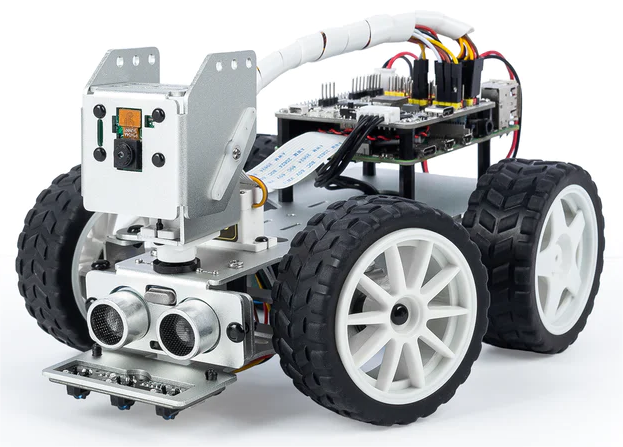

# Smart AI RC CCTV (Picar-X Optimization)



---

## 프로젝트 개요
SunFounder Picar-X Kit를 기반으로 한 고화질 실시간 스트리밍 및 자율 주행 통합 CCTV 시스템입니다. 1.4TB 대용량 외장 SD 카드를 활용한 보안 데이터 저장 환경을 구축하였습니다.

### 관련 링크
* 공식 GitHub: https://github.com/sunfounder/picar-x.git
* 조립 영상: https://youtu.be/GkLSBvtch0g?si=3eC0HKsoqJf2Sxdf
* 공식 문서: https://docs.sunfounder.com/projects/picar-x-v20/en/latest/

---

## 프로젝트 구조 (Project Structure)
```text
smart-rc-cctv/
├── app.py              # Flask 서버 및 로봇/카메라/센서 통합 제어 엔진
├── picarx.db           # 녹화 파일 메타데이터 관리용 SQLite DB
├── requirements.txt    # 의존성 패키지 리스트
├── img/                # 리소스 폴더
│   └── picar-x_v2.webp # README용 이미지
├── templates/          # 웹 인터페이스 템플릿
│   ├── index.html      # 실시간 대시보드 및 조종 화면
│   ├── player.html     # 저장 영상 재생 인터페이스
│   └── videos.html     # 녹화 파일 목록 아카이브
└── recordings/         # 초기 개발용 임시 녹화 폴더
```
---

##  하드웨어 및 환경
* **Main Board**: Raspberry Pi 4
* **Kit**: Picar-X Kit (AI Robot Kit)
* **OS Storage**: Micro SD Card / USB Drive (System Boot)
* **Data Storage**: **1.4TB External SD Card** (Video Data 전용)
* **Account**: `getpass.getuser()`를 통한 사용자 환경 자동 인식

##  주요 기능
* **실시간 1080p 스트리밍**: `vilib` 라이브러리를 최적화하여 저지연 영상 송출.
* **이중 녹화 시스템**: 서버(1.4TB 외장 SD)와 클라이언트(브라우저 대시보드) 동시 녹화 지원.
* **자율 주행**: 그레이스케일 센서 기반 낭떠러지 감지 및 초음파 센서 장애물 회피 로직 통합.

##  설정 및 실행 방법 (Setup)

### 1. 환경 구축 및 의존성 설치

1. 시스템 업데이트
```
sudo apt update && sudo apt upgrade -y
```


2. 프로젝트 복제
```
git clone [https://github.com/epqlffltm/smart-rc-cctv.git](https://github.com/epqlffltm/smart-rc-cctv.git)
cd smart-rc-cctv
```
3. 필수 모듈 설치 아래 공식 가이드를 참고하여 Picar-X 구동에 필요한 모든 모듈 및 의존성을 설치하십시오.
   * 설치 가이드: https://docs.sunfounder.com/projects/picar-x-v20/en/latest/python/install_all_modules.html

4. 실행
   ```
   python app.py
   ```

## 주요 디버깅 기록
* 파일 시스템 오류 해결: os.getsize 호출 오류를 os.path.getsize로 수정하여 데이터 정합성 확보.

* 프로세스 동기화: FFmpeg 인코딩 시작 전 2.5초의 대기 시간을 설정하여 비정상적인 데이터 종료 이슈 해결.

* 형상 관리 최적화: 다중 접속 환경(Windows-RPi)에서의 소스 불일치를 git reset --hard 전략으로 극복.

